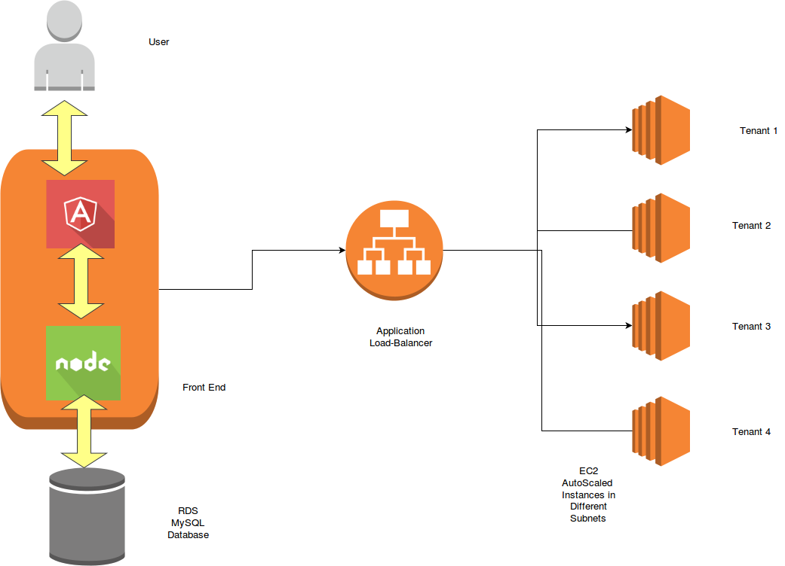

# UMLDiagramGenerator
Multitenant UML Diagram Generator

## Architecture

1. User interacts with AngularJS front-end and posts file to Node.JS backend.
2. Node.js backend redirects file to AWS Application Load Balancer
3. Application Load Balancer redirects request to auto-scaled tenant group. Depending on load, a tenant group may have 1-3 instances.
4. Application load balancer redirects to the service running on a healthy instance.
5. Tenant service uploads file to disk, unzips it, executes java command and generates image file.
6. Tenant service encodes image file and returns it as response which is redirected back to front-end.
7. User sees the image file generated and grades the result.
8. Result is posted to Node.js backend and redirected to RDS instance which inserts grade into db.

## Deployment
1. Deploy Angular JS code, contained in AngularJS folder and run Server.js in an AWS EC2 instance.
2. Deploy Node code,contained in Node folder and run Server.js in another EC2 instance.

